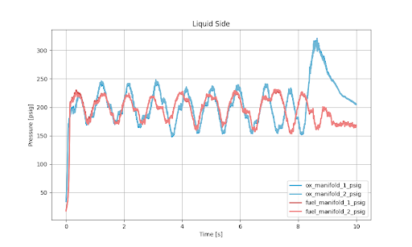
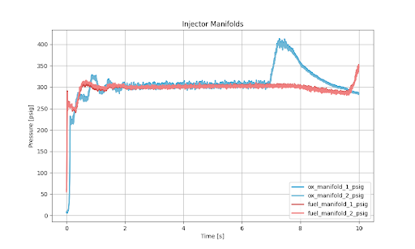
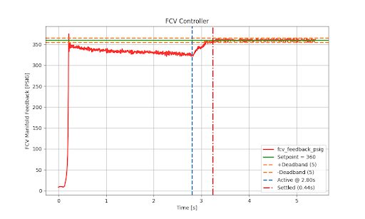
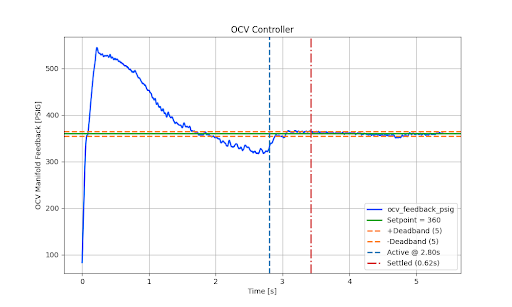
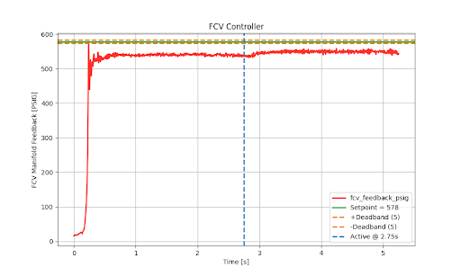
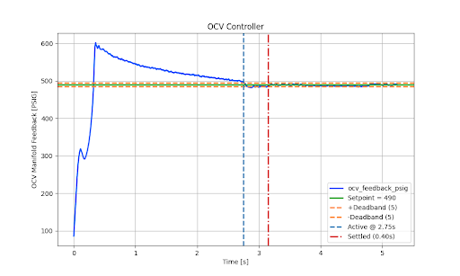

# CMFV Closed Loop Controller

This repo contains the embedded code on the Arduino MCUs which are hooked up to the CMFV encoder and stepper motor for closed loop control during engine static fires. 

It expects to receive pressure data through Serial from some source (a frequency of 100Hz will likely be more than sufficient), and sends telemetry back through that connection at a rate which can be specified in the `CommConfig` struct of [include/config.h](include/config.h). 

The packet formats for the abovementioned Serial communication can be found in [lib/modules/include/comm_handler.h](/lib/modules/include/comm_handler.h). 

## Running the Code

Simply use PlatformIO's "Upload" function to upload the code onto the Arduino, and it will run if your hardware configuration is correct. 

You can update various pins in [include/config.h](include/config.h), and we are using the [AMT22 Encoder](https://www.sameskydevices.com/product/motion-and-control/rotary-encoders/absolute/modular/amt22-series?srsltid=AfmBOorc7Xi-j3MuMLUL-870Ar_TA05ZwZF6NZ4BbV5iQRaEdjabf3QK) for motor angle measurement as well as the [Pololu High-Power Stepper Motor Driver 36v4](https://www.pololu.com/product/3730) for driving our stepper motors. 

## Achievements

### Waterflows

The initial proportional and integral gains that came from modeling (Kp = 0.3, Ki = 0.1) resulted in non-runaway oscillations as shown. 

Controller tuning was performed (using smaller Kp's and Ki's) to achieve stabler convergence as shown, validating closed loop control in non-cryogenic conditions. 

More details can be found [here](https://docs.google.com/presentation/d/1DPScJve0ODISY0kfSRFAYCtDJDlal3fuS9FHN40tNAw/edit?usp=sharing). 

### Coldflows

Our closed loop controller showed impressive control capabilities, resulting in the settling of the controller system to pressure set points within <0.7s of controller handoff

### Hotfire 11/1

Insufficient fuel tank pressure resulted in an unattainable fuel manifold pressure set point (~580 PSI). As part of FDIR procedures, due to the inability of the controller to manipulate the pressure to a redband around the set point within a set time after controller handoff, both controllers aborted into forced open loop. 

Check in next time for the results of subsequent hotfires!

## Unit Tests

PlatformIO uses the Unity testing framework for unit tests, which we use. See [test/README.md](test/README.md). 

## Credits

This code was jointly developed by [Daniel Zhou](https://github.com/danieljz23) and [Teong Seng Tan](https://github.com/asdiml), Controls Leads of UCLA Rocket Project, Ares (2025-2026). 

The graphs and slides referenced in [Achievements](#achievements) were created by Michael Ferrell, Project Lead of UCLA Rocket Project, Ares (2025-2026). 
